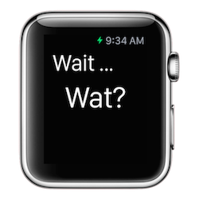
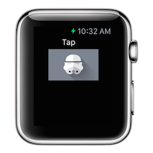
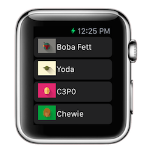
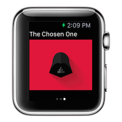
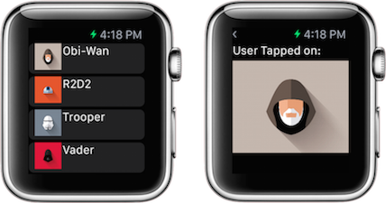

ios-watchkit-snippets
=====================

##Description
Code snippets using WatchKit for making Apple Watch Apps.  Each folder in this repo represents a different project described below.

##Language
Swift

###Project: HelloWatch

* A Simple 'Hello World' Apple Watch app.
* To run the Apple Watch app in the Simulator, simply choose the 'WatchKit App' target.
* Once the iPhone simulator is running, you may also need to navigate to __iOS Simulator--> Hardware --> External Displays --> Apple Watch__.

###Project: WatchButton

* Demonstrates using an IBAction for handling button tap event.
* Uses an IBOutlet to allow for programmatically updating the label's text. 
* Uses a custom image asset when presenting a button.

###Project: WatchImage (and Switch)

* Demonstrates using an IBAction for handling Switch event.
* Uses an IBOutlet to allow for programmatically setting an Image.

Shout out to [Filipe de Carvalho](https://www.behance.net/gallery/17998561/Star-Wars-Long-Shadow-Flat-Design-Icons) for the awesome art work!

###Project: WatchTable

* Adding a Table to the Interface.storyboard.
* Creating a row 'template' with an image and a label.
* Creating a TableRowController class in the WatchKit Extension target.
* Using the Identity Inspector to explicitly declare the TableRowController to be used by the Interface.storyboard.
* Populating table rows based on a Collection of Dictionaries.

###Project: WatchPageNavigation

* Demonstrates setting up an App that uses __Page based Navigation__ whereby a user can swipe right-left to move between different screens.
* Creating three distinct WKInterfaceController sub-classes - one for each page.
* In Interface.storyboard, adding a new InterfaceController for each page in the story board and explicitly declaring that InterfaceController's class in the Identity Inspector.
* Creating a segue between InterfaceController scenes.

###Project: WatchHierarchicalNavigation

* Demonstrates setting up an App that uses __Hierarchical Navigation__ or master-detail navigation - whereby a user can navigate to different screens and tap a 'back button' to go to the previous.
* The __TableInterfaceController__ is the WKInterfaceController subclass for the table screen.  This class is responsible for; programmatically populating the table rows and handling the passing of data from a tapped row to the DetailInterfaceController.
* The TableInterfaceController scene is composed of a Table that uses the __TableRowController__ to define the data for populating each row's label and image.
* The __DetailInterfaceController__ is the WKInterfaceController subclass which is responsible for presenting the 'details' for the table row that a user tapped on.
* In Interface.storyboard, a __push segue__ is created between the row and the DetailInterfaceController scene.  This segue has the identifier __DetailsSegue__.
* Data is passed from the __TableInterfaceController__ using the contextForSegueWithIdentifier method.
* Data is received by the __DetailInterfaceController__ in the awakeWithContext method.

###Deploying to your Apple Watch for Testing
To run an Xcode project on your Apple Watch, do the following:

* Connect your iOS device to your Mac.
* In Xcode, go to __Window__ --> __Devices__ and confirm that Xcode recognizes that your Apple Watch is paired with your iPhone device (see screenshot below).

* Choose the 'WatchKit App' target and your device to run. 
* Test the app on your watch!
* To remove your app from your Apple Watch, use the Apple Watch App on your iPhone to not show it.  To remove the app from both the Apple Watch and iPhone, simply delete the app from your iPhone.

##Connect
* Twitter: [@clintcabanero](http://twitter.com/clintcabanero)
* GitHub: [ccabanero](http:///github.com/ccabanero)